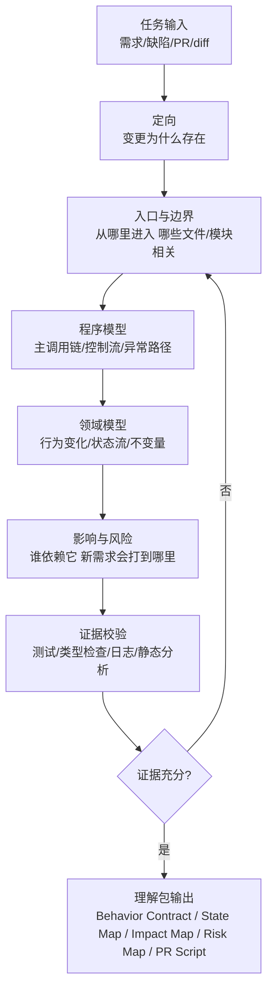
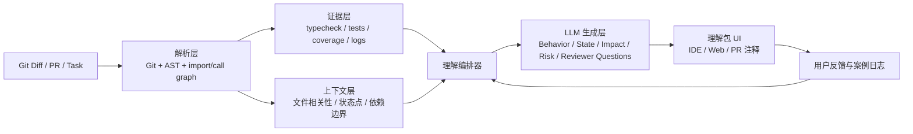

# 资深程序员如何理解和掌握一段程序

## 执行摘要

现有研究并不支持“资深程序员会逐行、等权、线性地读完整段代码”这种朴素想象。更接近事实的图景是：他们会先快速建立一个**可执行的程序模型**，通常以控制流、入口点、调用关系、异常路径为核心；随后再根据任务目标，逐步补上**领域/功能模型**，也就是这段代码在系统里“负责什么”“改变了什么行为”“状态怎么流动”“为什么这样设计”。Pennington 的经典研究表明，程序员往往先形成以控制流为中心的表征，之后才会形成更偏功能与数据流的表征，而且任务目标会影响后续哪类关系在心智模型中占主导。von Mayrhauser 与 Vans 则把这一过程概括为：程序理解并非一次性读懂，而是围绕假设生成、验证、修正、放弃的循环展开。citeturn30view0turn30view1turn31view0turn31view2

专家与新手的差异，也远不止“更熟”或“看得更快”。认知心理学的稳定结论是：专家会注意到新手看不到的**有意义模式**，知识组织围绕“大概念”和适用条件，而不是零散事实；他们能更低成本地提取关键知识，并在新情境中更灵活地重组。映射到代码理解上，LaToza 等人的研究发现，专家更容易抓住**根因**而不是症状，更容易挑中真正相关的方法，更倾向于用“缓存”“职责泄漏”“信息隐藏”等抽象语言来解释代码，而不是 statement-by-statement 地复述。眼动研究进一步显示，经验更丰富的程序员阅读源代码时往往**更不线性**，说明他们会跨行跳转、沿执行路径和概念锚点抽样，而不是按文本顺序均匀扫读。citeturn14view0turn14view1turn14view3turn28view0turn10view0

工业界的程序理解研究也高度一致地指向一个事实：真正耗时的不是“读字面”，而是**找相关处、沿关系追踪、保持上下文、确认风险与影响**。Ko 等人的实证研究把维护任务中的理解活动概括为 search–relate–collect 三类交错进行的活动，并观察到开发者平均有约三分之一时间消耗在导航机制本身；Roehm 等人对 28 位职业开发者的观察则显示，资深开发者会采用重复、结构化、依情境切换的理解策略，有时先从 UI 或运行行为入手，有时甚至刻意避免不必要的深理解，而是只理解“足够修改”的那一部分。与此同时，很多关键知识并不会被正式写下，它们滞留在人的脑中和团队互动中。citeturn9view0turn21view0turn29view0turn29view2turn23view1

把这些研究放到今天的 AI 编码环境里，会得到一个非常重要的产品结论：**AI 让代码生成加速，但没有同步降低“建立理解”的成本。**JetBrains 参与的 2026 年研究明确提出：对 LLM 生成的多文件代码变更，核心问题不是 diff 浏览，而是**信任校准**；有效流程应该分为总览、文件分析、代码片段审阅三层，并显式暴露风险与置信度信号。DORA 与 GitLab 的官方研究也都指出，AI 带来了显著的起草速度收益，但同时引入“verification tax（验证税）”，并把团队瓶颈从写代码转移到审查、验证、治理和追责。citeturn6view0turn6view1turn25view0turn25view1

因此，面向产品化的最佳切入点，不是继续做一个“自动找 bug”的 review 小工具，而是构建一个**代码理解层**：把资深程序员在短时间内会形成的关键心智产物，结构化地输出给一般开发者。这个理解层的最小高价值产物，不是“代码是否正确”的抽象评分，而是五类可复用对象：**Behavior Contract、State Map、Impact Map、Risk Map、PR Explanation Script**。这些产物既适合作为教学脚手架，也适合做半自动化工具的输出协议。它们和 Google / Microsoft 一线代码审查实践高度一致：小批量变更、明确动机、附带上下文、测试与自动化证据、面向项目实际情境的检查清单，是高质量审查的核心。citeturn5view5turn19view3turn19view4turn32view0turn32view3

## 研究目标与问题清单

这份报告的目标，不是抽象讨论“程序理解很复杂”，而是回答一个面向产品设计的具体问题：**资深程序员是如何在有限时间内，把一段陌生程序从“文本”转化为“可操作的系统理解”的？** 这一目标可以拆成六个面向产品的研究问题，它们综合了经典程序理解研究、专家-新手差异研究、调试/维护实证研究、代码评审研究与 AI 时代的新问题。citeturn13view0turn13view1turn8search0turn18search16turn6view0

| 研究问题 | 文献中对应主题 | 面向产品的解释 |
|---|---|---|
| 资深程序员先看什么 | 程序模型、入口点、控制流、beacons、任务上下文 | 决定首页与第一屏应该显示什么，而不是把所有 diff 平铺 |
| 他们如何分层理解 | 程序模型 → 领域模型；search–relate–collect；overview → file → snippet | 决定产品的多层工作流与缩放层级 |
| 他们如何识别“相关代码” | relevance cues、task context、DOI 模型、reachability questions | 决定如何做相关文件召回、扩散和折叠 |
| 他们如何识别风险与影响 | 根因 vs 症状、跨文件上下文、控制/数据/状态依赖 | 决定风险标注、影响分析、热点优先级 |
| 他们用什么证据确认理解 | 测试、运行行为、日志、类型/静态分析、问答验证 | 决定哪些环节必须靠确定性分析，哪些交给 LLM |
| 哪些步骤可以显式教学 | 心智图外化、检查清单、PR 叙述、问题脚本 | 决定产品是否能兼具“工具”与“训练器”双重价值 |

从产品视角看，这六个问题最终会汇聚成一个更可操作的目标：**把资深程序员在 review 之前脑中形成的“理解包”外显出来，并压缩成普通工程师也能快速消费的结构化输出。** 这与 Google 代码评审文档中强调的“设计、功能、复杂度、测试、命名、注释、文档”，以及 Microsoft 对作者上下文、动机说明、增量变更、检查清单和证据的强调，方向完全一致。citeturn5view5turn32view0turn32view3

## 文献基础与综合洞见

### 经典程序理解模型告诉了我们什么

程序理解研究最重要的早期结论之一，是 Pennington 对“程序模型”和“功能/领域模型”的区分。她发现，当程序员面对程序文本时，**最先形成的表征更接近控制流和程序分段**；随后，在更长时间、更具体任务目标的驱动下，才会形成更接近功能、数据流、真实世界对象的表征。也就是说，理解并不是一开始就到达“这段代码在业务上的意义”，而是先把“它怎么跑”抓牢，再把“它为什么存在、解决什么问题”补齐。citeturn30view0turn30view2

von Mayrhauser 与 Vans 对九十年代之前程序理解模型的综合则指出，几乎所有模型都包含三个共有元素：既有知识、新获得的知识，以及围绕代码建立出来的**mental model**。这个 mental model 是一个可以完整也可以不完整的工作表征，里面既有静态实体，也有动态元素；更重要的是，理解过程并不是线性的阅读，而是**依赖策略的假设循环**——程序员会提出假设，然后验证、修正或放弃它。这个观点对产品极重要，因为它意味着一个好的理解工具不该只“给答案”，而应帮助用户更快地提出和验证正确假设。citeturn31view0turn31view2turn31view3

更现代的综述也给出两个重要提醒。Storey 指出，程序理解研究应该同时考虑理论、工具和任务情境；Siegmund 则强调，尽管三十年来工具和 IDE 一直在进步，开发者花在理解上的时间并没有显著减少，这说明单纯加强局部功能并不自动转化成整体理解效率。研究若只做“工具加法”而不研究程序员本身，容易落入功能堆叠。citeturn13view0turn13view1

### 专家与新手究竟差在哪里

认知心理学关于专家-新手差异的结论，对程序理解非常适用。《How People Learn》的总结很凝练：专家与新手的差异，不主要来自一般智力或通用策略，而来自**他们注意到了什么、如何组织知识、如何表示问题**。专家会看出新手看不出的模式，知识围绕核心概念组织，且带有适用条件；因此他们能更低认知负担地提取关键因素并推进问题解决。citeturn14view0turn14view1turn14view3

Chi、Feltovich、Glaser 在物理问题分类研究中提出的经典观点——专家按“深层结构”分组而不是按表面特征分组——虽然研究对象不是程序，但它几乎就是高级工程师看代码时的写照：新手更容易被文件名、局部语句、表面相似性吸引；专家更容易按“职责”“状态机制”“因果路径”“设计意图”来归类问题。原始论文与后续引用都把这种深层结构差异视为专家表征能力的关键特征。citeturn16search11turn16search6turn14view0

程序理解领域内也有直接证据。LaToza 等人发现，专家在开放式代码修改任务中，并不会读更多方法，但更擅长筛出真正相关的方法；他们更关注根因而非症状，更经常用抽象词解释代码，更快完成修改。Peitek 等人的眼动研究则显示，经验更丰富的程序员读代码更不线性，说明他们的注意力部署并不平均，而是在概念锚点、控制路径、执行顺序和问题热点之间跳转。换句话说，专家不是“看得更多”，而是“看得更有选择”。citeturn28view0turn10view0

### 维护、调试与代码审查中的真实工作流

Ko、Myers、Coblenz、Aung 的维护任务研究，是把程序理解转成产品需求最有价值的工作之一。他们发现开发者在陌生代码上的活动可以用三个交织的动作描述：**搜索相关信息、沿依赖关系连接信息、收集任务所需的信息碎片**。其中巨大的摩擦来自导航本身：错误或误导性的线索会让搜索失败；找到相关代码后，调用/依赖关系追踪又会制造额外开销；上下文一旦丢失，还得重新找回。研究中，开发者平均有约 35% 的时间消耗在导航机制和上下文恢复上。citeturn9view0turn21view0

Roehm 等人的产业观察补充了另一个关键点：职业开发者会根据情境切换**重复的、结构化的理解策略**。这些策略包括 problem–solution–test 的工作模式、通过 UI 行为先建立预期、用运行时调试收集信息、在可能时克隆已有实现以避免深理解、记录笔记来反映 mental model 等。更重要的是，程序理解往往不是一个独立目标，而是某个维护或变更任务的子任务。产品如果把“理解流程”设计得太重、太脱离任务，会很难被真实开发者采用。citeturn29view0turn29view2turn29view3

LaToza、Venolia、DeLine 关于专家心智模型维护的研究，则解释了为什么“理解输出物”如此重要：很多关键信息默认存在人的脑中，开发者会先读代码，不行再问同事；而问人会造成打断，上下文在个人或小团队中形成 tacit ownership。与此同时，理解代码背后的**rationale** 是开发者最突出的痛点之一。也就是说，好的工具应该优先帮助用户回答“这段代码为什么这样设计、有哪些隐含约束”，而不是只给他一个表层摘要。citeturn23view1

Sillito 与后续 Fritz、LaToza 的工作还说明，程序员在变更任务中提出的问题本身就值得被产品化：从 44 类软件演化问题，到 78 类跨信息源问题，再到“reachability questions（什么情况下会到达这里、这个变化会影响到哪里）”这种横跨控制流的高频难题，都说明高级程序理解并不只是“读懂当前代码”，而是要回答一整套关于**因果、影响、条件、责任边界**的问题。citeturn18search16turn20view1turn26view0

### 代码审查研究给了哪些结构化启发

现代代码审查研究与工程文档几乎可以直接变成“理解包”的模板。Google 的评审文档把审查关注点压缩为：设计、功能、复杂度、测试、命名、注释、风格、文档；其更高层原则是：审查的主要目标不是追求局部完美，而是确保代码库长期健康持续改善。Google 的工程书进一步强调，代码评审的价值不止是找 bug，还包括让代码对他人**可理解**、强化一致性、促进团队所有权与知识共享。citeturn5view5turn19view3turn19view4

Microsoft 的研究则更细化地指出，作者侧最佳实践包括：小而增量的变更、附带上下文、记录动机、测试变更、运行自动化工具；审查者侧最佳实践包括：专门但有边界的审查时间、先看核心问题、使用与项目情境匹配的检查清单、必要时切换到 richer channel 讨论复杂问题。更值得注意的是，他们明确记录了一类工具需求：开发者希望能在 review 中**附带上下文、创建 narrative、接入笔记与文档系统**，帮助审查者快速形成理解，而不仅是看 diff。citeturn32view0turn32view3

这与您的产品方向高度一致：真正稀缺的不是“再多一个 lint 或 bot 评论”，而是**帮助普通开发者在审前形成接近高级工程师心智模型的结构化理解**。

### AI 时代的新变化

AI 并没有让这些问题消失，反而把它们推到了前台。Trust-Calibrated Code Review 这项 JetBrains 参与的 2026 年研究，把对 LLM 生成的多文件变更审查明确界定为**trust calibration problem**。研究提出的三层流程——overview、file-analysis、code snippet review——以及按行/按文件的风险信号、walk-through、zoom in/out 等设计构件，几乎就是对“代码理解层”该长什么样的直接启发。citeturn6view0turn6view1

官方行业研究也给出了强烈的需求侧信号。DORA 的官方文章指出，AI 最明显的收益在起草和启动阶段，但它带来了隐藏的验证税：时间从“写”转移到“审”和“验证”，并出现对 AI 代码低信任、作者快于评审者的负载错位。GitLab 的 2026 官方调查更明确：85% 的组织认为瓶颈已经从写代码转向 reviewing and validating，92% 报告 AI 代码治理挑战，84% 认为最大的挑战是 AI 代码生成之后的治理，43% 甚至无法可靠地区分 AI 代码与人工代码。citeturn25view0turn25view1

研究侧也在同一方向上收敛。AACR-Bench 指出，自动代码审查能否有效，强依赖**上下文粒度、检索方法和仓库级别上下文**；如果缺少多文件/仓库级依赖信息，评估与实际能力都会失真。这意味着你要做的工具不能只盯住 diff 文本本身，而必须把静态依赖、状态边界、测试证据和项目上下文都纳入理解层。citeturn24view0

## 资深程序员理解流程模型

### 一个可产品化的分层流程

综合以上研究，可以把“资深程序员理解一段程序”的过程，压缩成一个适合工具实现、也适合教学的七步模型。这个模型不是严格线性的，而是一个带回路的分层流程：先建立边界和行为，再进入状态与依赖，最后用证据和叙述把理解固化。它同时吸收了 Pennington 的“先程序模型后领域模型”、Ko 的 search–relate–collect、Roehm 的情境化结构策略，以及 AI 时代 trust-calibrated review 的分层工作流。citeturn30view0turn9view0turn29view3turn6view0



### 步骤、时间预算、触发条件与输出模板

下表中的时间预算是为“中等规模、陌生但非超大仓库”的现实任务设计的。对单文件 bugfix 可以大幅缩短；对 LLM 生成的多文件变更则应放大步骤三到六的预算。其关键不在于总时长，而在于**顺序与抽样策略**。

| 步骤 | 核心问题 | 典型动作 | 触发深挖的条件 | 典型时间 | 主要输出 |
|---|---|---|---|---:|---|
| 定向 | 这次变更/代码段为什么存在 | 读任务说明、PR 标题、缺陷描述、用户可见症状 | 需求描述含糊、动机不明、目标不可测试 | 2–5 分钟 | 一句话意图 |
| 入口与边界 | 我应该从哪里开始看 | 找 UI 入口、公开 API、主调用点、改动最大的文件、失败测试 | 无法确定入口；文件过多；相关范围失控 | 3–8 分钟 | 入口列表、相关文件集 |
| 程序模型 | 它怎么跑 | 顺主调用链走一遍，抓控制流、分支、异常、早返回、循环 | 跳转频繁、事件/异步/回调、跨线程、宏/反射 | 5–15 分钟 | 主路径摘要、依赖骨架 |
| 领域模型 | 它真的改变了什么行为 | 对照改前/改后，写行为合同，识别状态读写与不变量 | 行为无法一句话说清；状态来源/归宿不明 | 8–20 分钟 | Behavior Contract、State Map |
| 影响与风险 | 这会影响哪里，哪里最脆弱 | 找调用方/被调方、持久化、序列化、权限、安全、性能扇出 | 跨文件状态、共享可变对象、外部 IO、兼容性边界 | 8–15 分钟 | Impact Map、Risk Map |
| 证据校验 | 我凭什么相信这段理解 | 看测试、跑类型检查、读日志、局部实验、对照失败/成功样本 | 没测试、测试不覆盖关键路径、证据与叙述冲突 | 5–20 分钟 | Evidence bundle |
| 解释与扩展 | 我如何向 reviewer 说明，并知道未来怎么改 | 生成 PR 说明、准备 reviewer questions、标出扩展点 | 无法说清“为什么这么改”或“下次改哪里” | 5–10 分钟 | PR Explanation Script、Extension Points |

### 这个流程背后的三条核心原则

第一条原则是**先定范围，再定细节**。研究一再表明，理解失败经常不是因为“不够聪明”，而是因为把注意力投在了错误的位置。专家并不读更多方法，而是更早排除不相关方法。Ko 的研究中，误导性 cues 会让开发者在搜索阶段就走偏；LaToza 的专家-新手对比也说明，专家的优势很大部分来自“选对了应该理解什么”。citeturn9view0turn28view0

第二条原则是**先建立程序模型，再补领域模型**。如果一上来就试图直接在语义层“总结代码做了什么”，而没有抓住执行路径、状态更新点、跨文件边界，就会生成一种看似顺滑、实则不可靠的理解。这和 Pennington 的程序模型优先、Peitek 的非线性阅读、Trust-Calibrated Review 的 overview → file → snippet 都是一致的。citeturn30view0turn10view0turn6view1

第三条原则是**理解必须最终落到证据上**。Whyline 的研究提醒我们，即使是有经验的开发者，对因果关系的初始猜测也经常是错的；光靠主观解释不够，必须回到测试、日志、类型系统、运行时行为、静态依赖上。有理解、没证据，等于没有完成“掌握”。citeturn23view2

## 可教学产物与模板

### 为什么理解一定要外化成产物

文献已经很清楚地说明，开发者心智模型丰富但高度隐性，团队知识既依赖代码本身，也依赖面对面交流、临时草图和个人上下文；而这些恰恰最容易在 AI 时代失真或蒸发。把理解外化成稳定产物，一方面能降低上下文丢失，另一方面也能把“专家在脑中做的事”转成可训练的显式步骤。Mylar 的 DOI 模型、信息碎片组合模型、Microsoft 对 narrative/context 的工具需求，都在说明：**理解不是只存在于头脑中的事，它可以被结构化捕获。** citeturn23view1turn20view0turn20view1turn32view3

### 可直接用于产品的五个模板

下面五个模板可以直接作为你的产品输出协议。它们既是 UI 的骨架，也是训练用户的脚手架。

#### Behavior Contract

```markdown
# Behavior Contract

## 变更目标
一句话说明：这段代码/这次变更要让系统发生什么可观察变化？

## 改前行为
- 用户/系统原来会看到什么？
- 哪些边界情况原来不会发生？

## 改后行为
- 新增/删除/改变了哪些行为？
- 哪些输入、事件、状态将触发新路径？

## 非目标
- 这次没有试图解决什么？
- 有哪些相关问题暂时不处理？

## 行为证据
- 对应测试：
- 运行日志/截图：
- 手工验证步骤：
```

这个模板对应的是“先把代码还原成行为”，它能迫使使用者离开语法表层，回到 reviewer 真正关心的“这会让系统多做/少做/不同地做什么”。这与 Google 把功能、设计、测试放在 review 首位完全一致。citeturn5view5turn19view3

#### State Map

```markdown
# State Map

## 关键状态
| 状态名 | 来源 | 持有者 | 更新点 | 读取点 | 生命周期 | 约束/不变量 |
|---|---|---|---|---|---|---|

## 状态流
- 初始化：
- 正常更新：
- 回滚/重置：
- 序列化/持久化：
- UI/日志暴露：

## 可疑点
- 是否存在跨文件共享可变状态？
- 是否存在重复写入、延迟写入、竞态或时序依赖？
```

State Map 对应 Pennington 的数据流/功能层和现代维护中的“状态是谁的、从哪来、去哪儿”的关键问题。它尤其适合 AI 生成代码，因为 AI 常把“状态已加进去”与“状态已被系统性纳入所有生命周期”混为一谈。citeturn30view0turn31view2turn26view0

#### Impact Map

```markdown
# Impact Map

## 直接影响
- 改动文件：
- 直接调用者：
- 直接被调者：
- 直接依赖的数据结构 / 配置 / 表 / 接口：

## 间接影响
- 受影响测试：
- 受影响缓存 / 任务 / 定时器 / 订阅关系：
- 受影响序列化 / 存储 / 兼容性：
- 受影响权限 / 安全边界 / 监控指标：

## 假设性变更测试
如果未来要：
- 让 X 影响 Y
- 新增 Z 状态
- 做持久化/恢复
- 引入并发/批量处理

会优先改哪里？
```

Impact Map 来自维护研究中大量“question asking”文献的直接启发——开发者高频在问“会影响哪里”“什么情况下会到这里”“这一改会打到哪些路径”。它是从“当前理解”走向“未来可维护性”的桥。citeturn18search16turn20view1turn26view0

#### Risk Map

```markdown
# Risk Map

## 高风险点
| 风险点 | 风险类型 | 为什么危险 | 现有证据 | 尚缺证据 | 建议动作 |
|---|---|---|---|---|---|

## 风险类型参考
- 行为偏差
- 状态不一致
- 边界条件遗漏
- 跨文件依赖误判
- 并发/时序
- 性能扇出
- 安全/权限
- 兼容性/迁移
- 可维护性债务
```

Risk Map 对应的不是“找所有 bug”，而是**判断哪里薄弱但暂时可接受，哪里已经不能接受**。这与 Google 的 code health 原则、Microsoft 的核心问题优先、AI 时代的 trust calibration 都相吻合。citeturn19view4turn32view0turn6view0

#### PR Explanation Script

```markdown
# PR Explanation Script

## 一句话摘要
这次改动是为了 ________ 。

## 核心变化
1. 在 ________ 中新增/修改了 ________ 。
2. 主路径变化发生在 ________ 。
3. 关键状态变化是 ________ 。

## 为什么这样做
- 约束条件：
- 备选方案：
- 取舍理由：

## 风险与验证
- 最大风险：
- 已有证据：
- 缺失证据：
- reviewer 应重点看：

## 后续演化
如果后续要支持 ________ ，建议从 ________ 扩展，而不是直接再堆到 ________ 里。
```

这类脚本是对“理解是否真的形成”的最好测试之一。如果一个开发者无法向别人说明设计取舍、影响范围与风险，他大概率还没有真正掌握代码。这与代码审查的知识共享目标完全一致。citeturn19view1turn19view3

### 一个简短但高价值的审前检查清单

下面这个清单，适合作为产品中的“提交前自证”面板。它不替代审查，只是先把最低限度的理解责任显性化。

| 检查项 | 是/否 |
|---|---|
| 我能用一句话说明这段代码/这次变更的目标 |
| 我知道主路径从哪里进入、从哪里退出 |
| 我知道关键状态在哪里创建、更新、读取、销毁 |
| 我知道至少三个直接影响面和一个间接影响面 |
| 我知道当前最可疑的一个风险点 |
| 我有至少一条与核心行为变化直接对应的证据 |
| 我能预判 reviewer 最可能追问的问题 |
| 我能说明未来若增加相邻需求应从哪里扩展 |

## 工具与自动化实现方案

### 产品原则

这类产品最重要的架构原则，是把**确定性分析**与**生成性解释**分开。静态依赖、AST、类型信息、测试结果、覆盖率、CI 输出、日志样本，应尽可能由确定性系统生成；LLM 的职责更适合放在叙述压缩、问题生成、层级讲解、缺口提示与教学反馈上。这样做一方面能避免“全交给模型猜”，另一方面也更符合 AACR-Bench 关于上下文与检索的重要性、以及 AI 时代 trust calibration 的要求。citeturn24view0turn6view0

### 一个推荐的系统结构



这类结构直接继承了 Mylar 的 task-context 思路、信息碎片组合模型、Microsoft 对 narrative/context 的工具诉求，以及 AI-ready review 研究提出的分层浏览与风险信号。citeturn20view0turn20view1turn32view3turn6view1

### 功能模块、技术路线、衡量指标与优先级

| 模块 | 目标 | 推荐技术 | 成功指标 | 优先级 |
|---|---|---|---|---|
| 变更摄取与范围界定 | 找到入口、边界、相关文件 | Git diff、tree-sitter、language server、ripgrep | 相关文件召回率、误报率 | P0 |
| 行为合同生成 | 把 diff 还原成改前/改后行为 | LLM + task prompt + 测试/日志证据拼接 | 用户“能否解释”提升、自评分歧义下降 | P0 |
| 证据汇总层 | 把测试、typecheck、coverage、静态告警关联到理解包 | CI API、测试解析、coverage map | 关键行为是否有对应证据 | P0 |
| 状态/依赖提取 | 識别关键状态、读写点、跨文件依赖 | AST、CFG/DFG、符号引用、schema/parser | State Map 完整度、遗漏率 | P1 |
| 风险/影响分析 | 标出热点、边界、未来变更影响面 | 规则引擎 + LLM 解释 | reviewer 追问命中率、事后问题预测率 | P1 |
| Reviewer Questions 生成 | 帮用户做审前准备 | Prompting + few-shot + repo context | 问题相关性、覆盖广度 | P1 |
| PR Script 生成 | 让用户能清楚讲明白 | 模板 + 证据约束的 LLM | reviewer 接受度、返工轮次 | P1 |
| 个人学习日志 | 追踪理解能力成长 | case log、embedding、复盘 UI | 理解时间下降、预测准确率上升 | P2 |

### 一组可落地的规则集

在第一版中，风险识别不要试图“无所不包”，而应从少数高价值边界出发。下面这组规则最适合做 P0/P1：

| 规则 | 触发条件 | 输出 |
|---|---|---|
| 持久化边界 | 改动命中 DB schema、serialization、save/load、cache key | 提醒生成持久化影响面与兼容性检查 |
| 共享可变状态 | 新增全局状态、跨模块 mutable object、单例、事件总线订阅 | 提醒生成 State Map 并检查时序/竞态 |
| 行为扇出 | 改动发生在 tick loop、request middleware、公共基类、框架 hook | 标为高影响热点，要求性能与回归证据 |
| 安全/权限边界 | 命中 auth、ACL、token、session、permission、input validation | 强制进入高风险审查模板 |
| API/契约边界 | 改动 public API、response schema、event payload | 触发 Impact Map 与兼容性声明 |
| 测试不对齐 | 核心行为变了但没对应测试/断言 | 提醒“理解未闭环” |
| 解释缺口 | LLM 无法给出明确动机/不变量/风险 | 标记为“必须人工深读” |

这些规则的理念与 Google / Microsoft 的实际审查关注点和 DORA 的“小批量、高证据、把自动化前移到作者侧”是相符的。citeturn5view5turn32view0turn25view0

### 示例 prompts

下面是更适合“理解层”而不是“写代码层”的 prompts。它们都显式要求模型区分**事实、推断、缺失证据**。

#### 生成 Behavior Contract

```text
你是代码理解助手，不是代码生成助手。
请根据以下输入：
1) 任务说明
2) git diff
3) 关键文件片段
4) 测试结果/日志证据

输出一份 Behavior Contract，必须区分：
- 已从代码与证据中确认的事实
- 基于代码结构的合理推断
- 当前仍缺失证据、需要人工确认的点

格式：
- 一句话目标
- 改前行为
- 改后行为
- 非目标
- 证据清单
- 不确定点
```

#### 生成 State Map

```text
请从下列代码与 diff 中识别“关键状态”的生命周期。
不要逐行解释代码；只输出对工程师有用的状态地图。

对每个状态给出：
- 状态名
- 来源
- 持有者
- 更新点
- 读取点
- 生命周期
- 不变量
- 风险

如果某项无法确认，明确标注“未知”，不要编造。
```

#### 生成 Reviewer Questions

```text
你是高级工程师 reviewer。
根据任务说明、diff、Behavior Contract、State Map、测试结果，
生成 8 个 reviewer 最可能追问的问题。

要求：
- 问题优先覆盖设计、行为边界、状态一致性、影响范围、测试充分性
- 优先提那些“答不上来就说明作者尚未真正理解代码”的问题
- 每个问题后附一句：为什么 reviewer 会问
```

### 先做自动化还是先做半自动化

最现实的路线不是一开始就追求全自动，而是**先做半自动理解包**。原因有三点。第一，研究已经说明程序理解高度依赖任务、上下文和“相关性判断”，完全自动化的误判成本很高。第二，AI 时代的关键问题是信任校准，而不是省掉所有思考。第三，你自己就是首个高质量样本，最容易验证的是“这个包有没有让我更能解释代码”，而不是“模型是否 100% 替代资深 reviewer”。citeturn31view0turn25view0turn6view0

因此，建议的实现顺序是：

第一阶段，做一个**输入齐全、输出结构稳定**的 understanding packet 生成器。  
第二阶段，再把其中最稳定的几部分模块化：相关文件召回、State Map 骨架、Reviewer Questions。  
第三阶段，做个人案例日志与成长反馈，把它从工具升级为训练系统。

## 实验与验证计划

### 用五个个人案例验证的整体设计

由于你本身就是 AI coding 的重度使用者，这个方向非常适合做**单人高密度、重复测量**的早期验证。目标不是证明“工具绝对正确”，而是验证它是否显著缩短了你从“我拿到一坨 diff，不知敢不敢用”到“我能说明白它做了什么、哪里危险、哪里可扩展”的路径。这个目标与研究中“程序理解是任务子过程、且强依赖上下文”的事实一致：最有价值的早期数据，不是通用大样本，而是高质量、可复盘的真实任务样本。citeturn29view3turn33view0

推荐的五个案例配置如下：

| 案例类型 | 建议来源 | 目的 |
|---|---|---|
| 单文件小功能新增 | 你自己的 side project | 验证最小闭环 |
| 多文件功能新增 | AI 参与实现的 feature | 验证跨文件理解与 impact map |
| Bug fix | 有明确症状/回归样本的修复 | 验证 root cause 与 evidence |
| 重构或测试补充 | AI 协助改结构/补测试 | 验证“行为不变但结构变”场景 |
| 高风险边界变更 | 存储、API、状态同步、权限 | 验证风险识别与 reviewer question |

### 每个案例的实验步骤

每个案例都用同一套流程，形成可比较的数据。

#### 原始阶段

在不借助理解包的情况下，给自己 10 分钟，只允许看任务说明、diff 和必要文件。然后完成三件事：

1. 用不超过 150 字说明“这段代码做了什么”。  
2. 回答 8 个预设问题。  
3. 给自己打一个“敢不敢提交”的分值，0–5 分。

这一步是基线。

#### 干预阶段

再使用你的理解流程或半自动工具，生成完整的 Understanding Packet，包括：

- Behavior Contract  
- State Map  
- Impact Map  
- Risk Map  
- Reviewer Questions  
- PR Explanation Script  

#### 复测阶段

再次完成三件事：

1. 再写一次 150 字说明。  
2. 再回答同样 8 个问题。  
3. 重新给“敢不敢提交”打分。  

如果可能，再做两个客观任务：

- 预测“如果再加一个相关需求，会优先改哪些位置”。  
- 预测“reviewer 最可能提哪三个问题”。  

随后把真实 reviewer 的反馈或你未来复盘时发现的问题，与预测作比较。

### 衡量指标

推荐至少记录以下指标：

| 指标 | 说明 | 计算方式 |
|---|---|---|
| 理解覆盖分 | 对关键问题回答的完整性 | 8 个问题每题 0–2 分 |
| 解释质量分 | 是否能用抽象层次清楚说明，而非逐句复述 | 用 rubric 打分 |
| 影响预测准确度 | 对未来变更影响面的预测准不准 | 事后比对 precision / recall |
| reviewer 问题命中率 | 你预判的问题与真实追问重合度 | top-k overlap |
| 敢提交分 | 主观信心变化 | 前后差值 |
| 理解时间 | 到达“可解释状态”的耗时 | 分钟数 |
| 事后意外数 | 提交后才发现的遗漏/薄弱点数 | 计数 |
| 证据闭环率 | 核心行为是否有对应证据 | 有/无 + 比率 |

### 建议的评分 rubric

解释质量分可以按 4 个维度打分，每个 0–2 分：

| 维度 | 0 分 | 1 分 | 2 分 |
|---|---|---|---|
| 行为层 | 只复述代码 | 能说行为，但含混 | 能清楚说改前/改后 |
| 抽象层 | 逐句解释 | 有部分抽象词 | 能说职责、约束、意图 |
| 风险层 | 没提风险 | 提到但模糊 | 能指出具体热点与原因 |
| 影响层 | 不知道影响面 | 只知道直接影响 | 能说直接+间接影响 |

### 数据记录表模板

```markdown
# Case ID
2026-XX-XX-001

## 任务背景
- 项目：
- 任务类型：功能 / bug / 重构 / 测试 / 高风险边界
- 是否 AI 生成：部分 / 大部分 / 几乎全部
- 变更规模：单文件 / 多文件 / PR 行数

## 基线
- 10分钟后的一句话解释：
- 理解覆盖分：
- 解释质量分：
- 敢提交分（0-5）：
- 我最模糊的三个点：

## Understanding Packet
- Behavior Contract：
- State Map：
- Impact Map：
- Risk Map：
- Reviewer Questions：
- PR Script：

## 复测
- 再次一句话解释：
- 理解覆盖分：
- 解释质量分：
- 敢提交分（0-5）：
- 预测的影响面：
- 预测的 reviewer 问题：

## 事后验证
- 真实 reviewer 追问：
- 后续发现的问题：
- 预测命中：
- 新学到的模式：

## 结论
- 这次最值钱的输出物是什么？
- 哪个模块最值得自动化？
```

### 如何判断方向是否成立

如果五个案例中，至少出现如下三个信号，这个方向就值得继续投入：

第一，你在复测中显著更能**解释**代码，而不是只更“放心”。  
第二，真实 reviewer 的追问开始与理解包中的问题高度重合。  
第三，你开始发现某些输出结构在不同任务里反复稳定出现，比如 State Map、Risk Map、PR Script 总是有用。

如果没有这些信号，则大概率不是“需求不存在”，而是输出物定义还不对：你生成的可能仍是摘要，不是理解。

## 推荐阅读与优先引用列表

下面的列表按“对产品最有帮助的优先级”排序，优先保留英文原始来源；其中 DORA 报告页面还提供现代中文版本，适合团队内传播。citeturn5view4

### 基础认知模型

**Pennington, 1987, _Stimulus Structures and Mental Representations in Expert Comprehension of Computer Programs_**  
必读。理解“程序模型先于领域模型”“任务目标影响后续理解结构”的起点。你的产品若不区分这两层，很容易只做成摘要器。citeturn30view0turn30view1

**von Mayrhauser & Vans, 1995, _Program Comprehension During Software Maintenance and Evolution_**  
必读。提出围绕 mental model 与 hypothesis cycle 的综合视角，非常适合转译成“理解流程”和“深挖触发条件”。citeturn31view0turn31view2

**Storey, 2006, _Theories, tools and research methods in program comprehension_**  
适合做综述底座，用来建立“理论—工具—任务情境”三者之间的映射意识。citeturn13view0

**Siegmund, 2016, _Program Comprehension: Past, Present, and Future_**  
适合理解这个领域为什么长期难、为什么“工具很多，但理解时间没显著下降”。citeturn13view1

### 专家与新手差异

**Bransford, Brown, Cocking (eds.), _How People Learn_, Chapter 2: How Experts Differ from Novices**  
必读。虽然不是软件工程论文，但它给你“专家为什么看得不一样”的通用理论语言。citeturn14view0turn14view3

**Chi, Feltovich, Glaser, 1981, _Categorization and Representation of Physics Problems by Experts and Novices_**  
必读。帮助你把“表面特征 vs 深层结构”的差异，翻译成代码理解中的“文件名/语句 vs 职责/因果/状态机制”。citeturn16search11turn16search6

**LaToza et al., 2007, _Program Comprehension as Fact Finding_**  
非常有用。直接说明专家更关注根因、相关方法和抽象层级。你的 reviewer question 和 risk map 可以从这里获得很多启发。citeturn28view0

**Peitek, Siegmund, Apel, 2020, _What Drives the Reading Order of Programmers?_**  
用于支撑“高级程序员不是线性读代码”的观点，也能帮助你设计 diff 折叠与抽样策略。citeturn10view0

### 维护、调试与问题类型

**Ko et al., 2006, _An Exploratory Study of How Developers Seek, Relate, and Collect Relevant Information during Software Maintenance Tasks_**  
必读。几乎可以直接转写成你的产品工作流。citeturn9view0turn21view0

**Roehm et al., 2012, _How do professional developers comprehend software?_**  
必读。让你避免做出一个脱离真实工作流的“重理解工具”。重点看其结构化策略、UI 起点、避免不必要理解等观察。citeturn29view0turn29view2turn29view4

**LaToza, Venolia, DeLine, 2006, _Maintaining Mental Models: A Study of Developer Work Habits_**  
必读。解释为什么理解必须产物化，为什么 rationale 和 tacit knowledge 是核心痛点。citeturn23view1

**LaToza & Myers, 2010, _Developers Ask Reachability Questions_**  
必读。特别适合做 Impact Map 与“新问题会影响哪里”的功能设计。citeturn26view0

**Ko & Myers, 2008, _Debugging Reinvented: Asking and Answering Why and Why Not Questions about Program Behavior_**  
适合做“理解证据层”的设计参考，尤其是为什么不能只依赖人工猜测。citeturn23view2

### 代码审查与组织实践

**Google Engineering Practices: Code Review Guide**  
必读。把资深 reviewer 关注点压缩成几个维度，是模板设计的好来源。citeturn5view5turn19view4

**_Software Engineering at Google_, Chapter 9: Code Review**  
必读。能把“可理解性、知识共享、长期代码健康”这些价值准确说清楚。citeturn19view3

**Bacchelli & Bird, 2013, _Expectations, Outcomes, and Challenges of Modern Code Review_**  
必读。说明现代 review 不只是 defect detection，更是知识转移与团队 awareness。citeturn19view1

**Greiler et al., 2016, _Code Reviewing in the Trenches: Understanding Challenges, Best Practices and Tool Needs_**  
强烈推荐。它对“上下文、动机、叙述、工具需求”的描述，和你的产品方向极贴。citeturn32view0turn32view3

### AI 时代的新增资料

**Heander et al., 2026, _Trust-Calibrated Code Review_**  
当前最贴近你问题域的论文之一。建议作为 AI 时代产品定位的核心引文。citeturn6view0turn6view1

**AACR-Bench, 2026, _Evaluating Automatic Code Review with Holistic Repository-Level Context_**  
适合指导你为什么必须做 repo-level context，而不是只喂 diff。citeturn24view0

**DORA, 2026, _Balancing AI tensions: Moving from AI adoption to effective SDLC use_**  
适合用来表述“verification tax”“作者快于 reviewer”的现实背景。citeturn25view0

**GitLab, 2026, _AI Accountability Report / Research Reveals Organizations Are Generating AI Code Faster Than They Can Control It_**  
适合支持“治理、追责、可追踪性、review 瓶颈转移”的组织侧价值。citeturn25view1

### 书籍与经验性读物

**Diomidis Spinellis, _Code Reading: The Open Source Perspective_**  
非常适合作为“如何系统读代码”的长期训练读物。citeturn12search3turn12search13

**John Ousterhout, _A Philosophy of Software Design_**  
适合理解为什么“可理解性”最终要体现在模块边界、信息隐藏和复杂度控制上。citeturn12search7

**Jessica Livingston, _Founders at Work_**  
不直接讲程序理解，但适合补足工程实践与创业早期的经验背景；更适合作为气质层补充，而不是核心方法来源。citeturn12search19turn12search15

### 结论性的研究判断

如果把全部文献压缩成一句产品判断，可以表述为：

**资深程序员的优势，不是“记得更多代码”，而是更快地构建正确的多层心智模型：先定范围与入口，再抓控制/状态骨架，再判断影响与风险，最后用证据闭环并外化成可审查的解释。** 在 AI 时代，这个过程的重要性不降反升，因为生成速度已经不再是瓶颈，**理解、验证、追责和知识传递**才是。citeturn30view0turn31view0turn9view0turn28view0turn6view0turn25view1